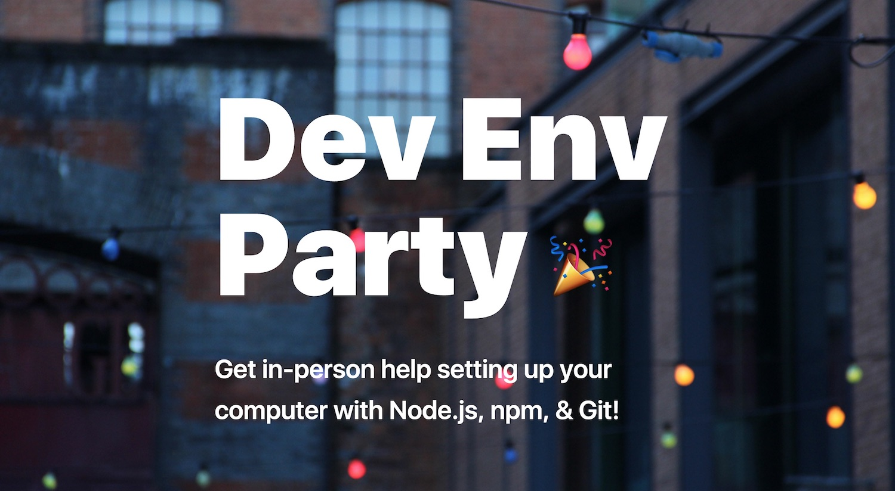

# devenv.party

Get in-person help setting up your computer with Node.js, npm, & Git!

[![conduct][conduct]][conduct-url]

[conduct]: https://img.shields.io/badge/code%20of%20conduct-contributor%20covenant-green.svg?style=flat-square
[conduct-url]: CONDUCT.md

### [devenv.party](https://devenv.party)

## Contributing

Contributions are welcome! Please read the [contributing guidelines](CONTRIBUTING.md) first.

## Conduct

It's important that this project contributes to a friendly, safe, and welcoming environment for all, particularly for folks that are historically underrepresented in technology. Read this project's [code of conduct](CONDUCT.md)

## Contact

- **chat** – You can chat about this project at [http://gitter.im/sethvincent/ask](http://gitter.im/sethvincent/ask)
- **issues** – Please open issues in the [issues queue](https://github.com/sethvincent/devenv.party/issues)
- **twitter** – [@sethdvincent](https://twitter.com/sethdvincent)

## License

[ISC](LICENSE.md)
